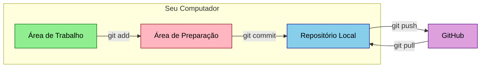

<!-- Título -->
# Git & GitHub

***Conteúdo do Projeto:***

**Principais Caraterísticas do Git:**

* **Distribuído:** Cada desenvolvedor possui uma cópia completa do repositório, incluindo seu histórico, permitindo trabalho offline.

* **Rastreamento de Alterações:** Registra cada modificação no código, mostrando quem fez a alteração e quando.

* **Branches (Ramificações):** Permite a criação de ramificações para desenvolver novas funcionalidades ou correções sem impactar a versão principal do código.

* **Mesclagem (Merge):** Facilita a combinação de alterações de diferentes ramificações, resolvendo conflitos quando necessários.

**O que é GitHub?**

GitHub é uma plataforma de hospedagem de código-fonte que utiliza o Git como sistema de controle de versão.

Lançado em 2008, o GitHub permite que desenvolvedores colaborem em projetos, compartilhem código e gerenciem repositórios de forma eficiente, oferecendo uma interface web intuitiva.

**Principais Caraterísticas do GitHub:

* **Repositórios:** Criação de repositórios públicos ou privados para armazenar projetos.

* **Colaboração:** Facilita a colaboração através de pull requests, onde alterações propostas podem ser revisadas antes de serem integradas ao projeto principal.

* **Issues:** Sistema de rastreamento de problemas para relatar bugs, solicitar funcionalidades e discutir melhorias.

* **GitHub Actions:** Automação de fluxos de trabalho, como integração continua e entrega contínua (CI/CD).

**Boas Práticas no uso de Git e GitHub:**

* **Commits Frequentes e Significativos:** Realize commits pequenos e frequentes com mensagens claras que expliquem as alterações.

* **Uso de Branches:** Crie branches para novas funcionalidades ou correções, mantendo o branch principal (main ou master) limpo e estável.

* **Pull Requests:** Utilize pull requests para revisar e discutir alterações antes de mesclá-las ao branch principal.

* **Mensagens de Commit Claras:** Escreva mensagens que expliquem o "o que" e "por que" das alterações.

* **Documentação:** Mantenha uma documentação clara e atualizada, incluindo um arquivo README que explique como configurar e usar o projeto.

* **Gerenciamento de Issues:** Utilize o sistema de issues do GitHub para rastrear bugs e solicitações de funcionalidades, organizando o trabalho e priorizando tarefas.

* **Revisão de Código:** Incentive a revisão de código entre os membros da equipe para melhorar a qualidade do código e promover aprendizado.

* **Sincronização Regular:** Mantenha seu repositório local sincronizado com o remoto, usando `git pull` regularmente.

* **Tags e Releases:** Use tags para marcar versões específicas do projeto, facilitando o gerenciamento de versões e a comunicação sobre novas funcionalidades ou correções.

* **Segurança:** Evite armazenar informações sensíveis no repositório, utilizando arquivos de configuração que não sejam versionados (como `.env`).

| COMANDOS | DESCRIÇÃO |
| :------- | :-------- |
| `git init` | Inicializa um novo repositório Git em um diretório. |
| `git clone <url>` | Cria uma cópia local de um repositório remoto. O <url> pode ser um link para um repositório no GitHub, GitLab, etc. |
| `git status` | Mostra o estado atual do repositório, incluindo arquivos modificados, não rastreados e prontos para commit. |
| `git add <arquivo>` | Adiciona um ou mais arquivos ao índice (staging area) para serem incluídos no próximo commit. |
| `git add .` | Adicionar todos os arquivos modificados. |
| `git commit -m "mensagem"` | Cria um novo commit com as alterações adicionadas ao índice, usando a mensagem fornecida para descrever o commit. |
| `git log` | Exibe o histórico de commits do repositório, mostrando informações como o hash do commit, autor, data e mensagem. |
| `git diff` | Mostra as diferenças entre as alterações não comitadas e a última versão do commit. |
| `git diff <arquivo>` | Mostra as diferenças entre as alterações não comitadas e a última versão do commit em um arquivo específico. |
| `git branch` | Lista todas as branches no repositório. |
| `git branch <nome-da-branch>` | Cria uma nova branch. |
| `git checkout <nome-da-branch>` | Muda para a branch específica. |
| `git checkout -b <nome-da-branch>` | Cria e muda para a nova branch criada. |
| `git merge <nome-da-branch>` | Mescla as alterações da branch especificada na branch atual. |
| `git pull` | Atualiza a branch local com as alterações do repositório remoto. É uma combinação de `git fetch` e `git merge`. |
| `git push` | Envia os commits da branch local para o repositório remoto. |
| `git remote -v` | Lista os repositórios remotos associados ao repositório local, mostrando suas URLs. |

## :memo: Explicação do Processo

Imagine que você está escrevendo um livro com seus amigos. Vocês querem garantir que:

* Todos possam ver o que já foi escrito.
* Possam fazer mudanças separadamente.
* Ninguém apague acidentalmente o texto dos outros.
* Seja possível voltar atrás se algo der errado.

O Git é como um sistema mágico que ajuda vocês a fazer isso com código de computador, enquanto o GitHub é como uma biblioteca digital onde você pode guardar seu livro para outros verem e colaborarem.

### Vocabulário Básico:

* `Commit` → Como salvar uma versão do seu trabalho ("salvar documento")
* `Branch` → Uma ramificação do projeto, como um capítulo separado
* `Repository` (Repo) → Pasta especial que guarda todo o projeto
* `Push/Pull` → Enviar/receber mudanças para/de um servidor

### Explicação Passo a Passo dos Comandos Principais:

1. **git init** &#8594; Como criar uma nova pasta mágica para seu projeto
    * É como colocar um selo especial na sua pasta dizendo "este é um projeto Git".

2. **git add** &#8594; Como preparar suas mudanças para salvar
    * Como organizar seus papéis antes de guardar na pasta.

3. **git commit** &#8594; Como salvar definitivamente suas mudanças
    * Como fechar um envelope com todas as alterações e escrever uma nota explicando o que foi feito.

4. **git push** &#8594; Como enviar suas mudanças para a biblioteca digital (GitHub)
    * Como entregar seu trabalho para o professor (ou equipe)

5. **git pull** &#8594; Como pegar as mudanças que os outros fizeram
    * Como baixar o trabalho que seus colegas enviaram

### Analogia Visual do Fluxo de Trabalho:

No diagrama acima:

* A área verde (Área de Trabalho) é onde você faz suas mudanças, como editar arquivos.
* A área rosa (Área de Preparação) é como uma mesa temporária onde você organiza o que vai salvar.
* A área azul (Repositório Local) é como uma caixa segura no seu computador que guarda todas as versões.
* A área roxa (GitHub) é como uma biblioteca digital onde todos podem ver seu trabalho.

### Cuidado!

* Sempre faça commits pequenos e descreva bem o que você fez.
* Não guarde senhas ou informações secretas nos arquivos.
* Antes de começar a trabalhar, sempre dê um `git pull` para ter as últimas mudanças.
* Se algo der errado, não se preocupe! O Git mantém registro de tudo e você pode voltar atrás.

### Exercício Prático:

1. Crie uma pasta nova para um projeto.
2. Faça `git init` dentro dela.
3. Crie um arquivo texto simples.
4. Faça `git add` e depois `git commit`.
5. Observe como o Git registra todas as mudanças.

Pratique regularmente e não tenha medo de experimentar. Com o tempo, você vai se sentir mais confortável usando esses comandos assim como usa um caderno escolar!

> [!IMPORTANT]\
> **Boas práticas**:
>
> * Commits Significativos.
> * Uso Estratégico de Branches.
> * Documentação Clara.
> * Revisão de Código.
> * Gerenciamento de Segurança.

---

> [!WARNING]\
> **Recomendações**:
>
> * Repositórios Modulares.
> * Branches de Feature.
> * Pull Requests Estruturados.
> * Automação de Processos.

---

> [!NOTE]\
> **Observações**:
>
> * Git é uma ferramenta essencial para desenvolvimento moderno.
> * Dominar Git vai além de conhecer comandos.
> * Cultura de colaboração é tão importante quanto a técnica.

---

### :clipboard: Próximos Passos

* **Aprofundamento Técnico**
  * Estudar estratégias avançadas de branching.
  * Compreender integração com ferramentas de CI/CD.
  *Práticas de code review corporativo.

* **Desenvolvimento Prático**
  * Criar projetos com múltiplos colaboradores.
  * Implementar workflows reais.
  * Experimentar diferentes estratégias de merge.

* **Segurança e Governança**
  * Configurar proteções de branch.
  * Implementar revisões obrigatórias.
  * Gerenciar permissões de repositório.

### :bookmark: Tags

`#Git` `#GitHub` `#ControleDeVersão` `#DevOps` `#Colaboração` `#BoasPráticas`

<!-- Informações -->
### &#8505; Informações

&nbsp;

&nbsp;

&nbsp;

&nbsp;

&nbsp;

&nbsp;

